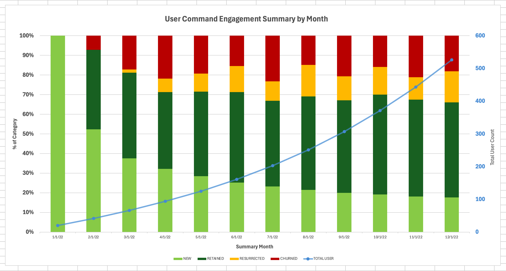

# AE Take-Home
This is my submission for the Warp AE take-home assignment.

## Running the dbt project
Execute:
- Create virtual environment (e.g. python 3.11)
- Install dbt (used dbt core 1.8 with Snowflake adaptor)
  - Run `pip install -r warp_data_management/requirements.txt`
- Configure dbt profile based on your warehouse setup ([sample profile](warp_data_management/sample_profiles.yml))
  - All assets are materialized under one schema for simplicity
- `cd` into `warp_data_management`
- Run `dbt deps`
- Run `dbt build`

## Question 1
#### Write a SQL query to report out new users, retained users, resurrected users, and churned users by month from January through December 2022.

_Answer_: [View the SQL query results in CSV](resources/q1_sql_answer.csv)

| Month | New Users | Retained Users | Resurrected Users | Churned Users |
|-------|-----------|----------------|-------------------|---------------|
| 2022-01-01 | 20 | 0 | 0 | 0 |
| 2022-02-01 | 22 | 17 | 0 | 3 |
| 2022-03-01 | 24 | 28 | 1 | 11 |
| 2022-04-01 | 28 | 34 | 6 | 19 |
| 2022-05-01 | 31 | 47 | 10 | 21 |
| 2022-06-01 | 36 | 66 | 19 | 22 |
| 2022-07-01 | 42 | 79 | 18 | 42 |
| 2022-08-01 | 48 | 106 | 36 | 33 |
| 2022-09-01 | 56 | 132 | 34 | 58 |
| 2022-10-01 | 64 | 169 | 47 | 53 |
| 2022-11-01 | 72 | 196 | 45 | 84 |
| 2022-12-01 | 83 | 228 | 75 | 85 |

## Question 2
#### Create a graph that represents this information in a helpful way.

_Answer_: [View full-size image](resources/viz_user_command_engagement_summary.png)

- This was created using Excel.
- Using a stacked bar chart to visualize the % makeup of each user category by month has an advantage of showing what type of engagement is more common in a given month. Dark green bar (retained user %) seems to have steadily expanded over 2022, indicating healthy user retainment.
- Color coding tries to visually convey "health", thus new and retained users are in green and resurrected and churned are orange and red.
- I added a blue line chart off of the secondary axis to show absolute user growth, which adds some helpful context as we're only looking at percentages on the categories.
- There are other visualization options which might provide value, e.g. we can try creating another chart to show absolute counts by category.

## Question 3
#### Suggest ONE intermediate table to help less SQL-adept Warp employees answer questions about churn, resurrections, and retention.

_Answer_: [View the dbt model source code](warp_data_management/models/marts/intermediate/user_command_engagement_summary/int_user_command_engagement_summary_monthly.sql)

| Column | Description |
|--------|-------------|
| user_id | Unique identifier for user |
| user_role | Developer role user claimed to be |
| user_created_month | Month of user account creation |
| spine_month | Month of engagement tracking summary, on a user level this is basically every calendar month since the user's account creation |
| command_event_month | Month when user executed at least one command |
| is_active | Boolean flag to indicate whether user executed at least one command in a given month or not |
| is_active_prev_month | Boolean flag to indicate whether user executed at least one command in the immediate previous month or not |
| is_new_user | Flag to indicate whether user is considered a new user in a given month, 1=yes, 0=no. |
| is_retained_user | Flag to indicate whether user is considered a retained user in a given month, 1=yes, 0=no. |
| is_churned_user | Flag to indicate whether user is considered a churned user in a given month, 1=yes, 0=no. |
| is_resurrected_user | Flag to indicate whether user is considered a resurrected user in a given month, 1=yes, 0=no. |
| is_inactive_user | Flag to indicate whether user is considered a user that doesn't fall in any of the other categories and is inactive in a given month, 1=yes, 0=no |

- This intermediate model makes good sense because to get to the monthly summary this is pretty much the "preparation" transformation needed anyway.
- Transformations that are involved: (1). Attaching a date spine so each month including those when user did not execute commands can be summarized, this also helps with categorying users; (2). Defining analysis granularity (e.g. monthly, weekly) by finding unique dates where user executed at least one command.
- To do weekly level analysis, we can replicate the model and change the granularity to weekly. And there might be opportunities to further modulize the dbt models.
- User role is added to this intermediate table to allow role-specific analysis. We can also write queries to analyze improvements of user retention performance (e.g. find the % delta between months on % of users that were retained.)

## Question 4
#### Suppose the growth team has noticed that frontend engineers are churning at 3x the rate of backend and devops. The growth team needs to decide whether to allocate resources towards the underperforming segment or double-down on the better performing segments. What are some additional pieces of data/analyses you think would be helpful in making this decision (please brainstorm data beyond the two sample tables we provided)! A short paragraph or two is great.

_Answer_:

Two things come to mind immediately: command analysis and demographics analysis.

Having a log of commands executed by timestamp by user is great, but this is where having the actual commands come to the rescue. Analyze the usage rate of each category of high impact commands (e.g. AI invocations, specific CLI commands--AWS, kubectl, package management, etc., ) and maybe error rates, compare to other roles to understand potential differences in adoption of Warp.

Do we have further breakdown of demographics data, such as levels of dev experience, title, age, programming language? Analyze whether our growth strategies or specific acquisition campaigns (hackathons, partner programs, university promotion) disproportionately attracted FE users with different retention profiles.

Additionally, if we have access to quality churn surveys and/or user interviews, we try to understand whether a key capability might be missing for FEs. Are they doing anything significantly different than BEs and DevOps? What commands are they running that might be contributing to frictions? Is there a different tool they prefer and why?

Lastly, to determine where resources should be allocated towards comprehensively, we might need to factor in role specific data such as acquisition cost, LTV, stickiness level, referral rate. Revenue and marketing data might help shed some light.

## Extra

Added a dbt [custom data test](warp_data_management/tests/test__int_user_command_engagement_summary_monthly.sql) to validate the transformation logic of [the intermediate model](warp_data_management/models/marts/intermediate/user_command_engagement_summary/int_user_command_engagement_summary_monthly.sql). Every row (user_id+month) should have a category assigned, so summing the categories should equate to the total row count. This test would help catch potential logic bugs or data quality issues from source tables.
